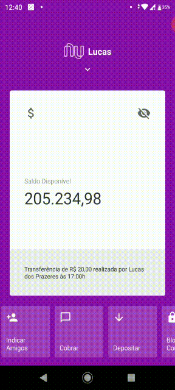

# Nubank Clone :money_with_wings:


Uma reprodução React Native do App do Nubank!



## Sobre
O app consiste um uma interface React Native que simula o app do Nubank (com animações!), mas, até o momento, sem funcionalidades extras.

*Esse projeto foi originalmente desenvolvido por @diego3g, [nesse vídeo](https://www.youtube.com/watch?v=DDm0M_rZLJo&t=35s). Porém, ele sofreu algumas adaptações, como, por exemplo, o uso das ferramentas expo e typescript!*

## Tecnologias utilizadas :mag:
* React Native
* Expo
* TypeScript
* Styled Components
* React Native Animations

## Teste você mesmo! :sunglasses:

Para isso, é preciso ter, em sua máquina, o nodejs e o npm. Além disso, baixe o Expo em seu celular!

```bash
# clone o repositório

git clone https://github.com/lucascprazeres/Nubank-Clone.git

# prepare o ambiente

cd Nubank-Clone
npm install

# Exute o projeto
npm start

#Escaneie o QRCode com seu app mobile expo
#...Happy Hacking!
``` 


## Como contribuir? 🤔

Faça um fork do repositório :)

```bash
# Clone o seu fork

git clone <url-do-seu-fork>
cd Nubank-Clone

# Crie uma branch com sua melhoria ou correção de bugs

git checkout -b <sua-branch>

# Faça o commit das suas alterações

git add .
git commit -m '<notas da alteração>'

# Faça o push para a sua branch

git push origin <sua-banch>
```

Você pode deletar a sua branch quando o merge da sua pull request for feito

***
Feito com :purple_heart: por [Lucas dos Prazeres](https://www.linkedin.com/in/lucas-prazeres/)


